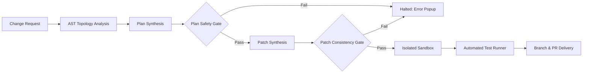

# ChangePilot — Complete Application User & Technical Guide

Welcome to the **ChangePilot Complete Application Guide**. This document provides an exhaustive, step-by-step walkthrough of every section, tab, button, feature, workflow, and underlying safety mechanism in the ChangePilot platform.

---

## Table of Contents

1. [Platform Overview & Architecture](#1-platform-overview--architecture)
2. [Authentication & Workspace Access](#2-authentication--workspace-access)
   - [Theme Switcher (Dark / Light Mode)](#theme-switcher-dark--light-mode)
   - [Single Sign-On (Google OAuth)](#single-sign-on-google-oauth)
   - [Work Email Sign In & Registration](#work-email-sign-in--registration)
3. [Global Layout & Navigation](#3-global-layout--navigation)
   - [Top Navigation Bar](#top-navigation-bar)
   - [Left Sidebar Navigation](#left-sidebar-navigation)
   - [Global Toast & Notification Popup System](#global-toast--notification-popup-system)
4. [Detailed Guide for Every Tab & View](#4-detailed-guide-for-every-tab--view)
   - [4.1 Dashboard](#41-dashboard)
   - [4.2 Change Requests](#42-change-requests)
   - [4.3 Pipelines (9-Stage Autonomous Engine)](#43-pipelines-9-stage-autonomous-engine)
   - [4.4 Change Results (Diff Viewer & Patch Delivery)](#44-change-results-diff-viewer--patch-delivery)
   - [4.5 Repositories Management](#45-repositories-management)
   - [4.6 Stability & Performance Reports](#46-stability--performance-reports)
   - [4.7 System Audit Trail](#47-system-audit-trail)
5. [The 9 Deterministic Safety Gates Explained](#5-the-9-deterministic-safety-gates-explained)
6. [Repository Discovery & Import Workflows](#6-repository-discovery--import-workflows)
   - [Connecting with GitHub / Azure DevOps Platform](#connecting-with-github--azure-devops-platform)
   - [Importing Public Git Repositories](#importing-public-git-repositories)
   - [Multi-Language Topology Inspection](#multi-language-topology-inspection)
   - [Unlinking / Removing Repositories](#unlinking--removing-repositories)
7. [Error Handling & Developer Diagnostics](#7-error-handling--developer-diagnostics)
8. [Troubleshooting & FAQ](#8-troubleshooting--faq)

---

## 1. Platform Overview & Architecture

**ChangePilot** is an enterprise-grade autonomous software-change platform. It combines **Google Vertex AI (`gemini-3.5-flash` / `gemini-3.7-flash`)** with **9 deterministic, non-negotiable safety gates** and **disposable sandboxed execution workspaces** to safely synthesize, validate, test, and deliver code modifications across cloud and Git repositories.

---

## 2. Authentication & Workspace Access

ChangePilot provides a secure authentication gateway before granting access to codebases and automated pipelines.

### Theme Switcher (Dark / Light Mode)
* **Location:** Top-right corner of the login card.
* **Functionality:** Toggles between **Dark Mode** (`#0B0E14` dark surface) and **Light Mode** (`#F6F8FA` crisp white cards, `#1F2328` dark typography, `#D0D7DE` light borders).

### Single Sign-On (Google OAuth)
* Click **Continue with Google**.
* ChangePilot authenticates with Google Identity Services using your configured client ID. On token verification, it creates/links your account and directs you into the workspace.

### Work Email Sign In & Registration
* **Sign In:** Enter work email and password, then click **Sign In with Email**.
* **Create Account:** Switch to the **Create Account** tab, enter Name, Email, and Password, then click **Create Account** to register a new authenticated workspace identity.

---

## 3. Global Layout & Navigation

### Top Navigation Bar
* **Service Status Indicators:**
  - **`API` [✓]**: Live green checkmark indicating active connection with the FastAPI backend server on port 8000.
  - **`Vertex AI` [✓]**: Live green checkmark indicating Vertex AI Gemini client readiness.
  - **`Repo` [✓]**: Live green checkmark indicating repository discovery service is active.
* **Global Search (`/`):** Instant filter across stories, repositories, and logs.
* **Notification Bell:** Live unread counter and dropdown history of recent pipeline events.
* **Theme Switcher:** Toggles Dark and Light mode across all application components.
* **User Profile Avatar:** Displays user name, role, email, and the **Sign Out** action.

### Left Sidebar Navigation
* 📊 **Dashboard:** Key metrics, active pipeline monitor, and recent run history.
* 🌿 **Change Requests:** Formulation form to submit new software change stories.
* ⚡ **Pipelines:** Live 9-stage progression tracker with real-time terminal audit trail.
* 📝 **Change Results:** Unified diff viewer, file modification summary, and test verification output.
* 🗄️ **Repositories:** Managed codebases, branch discovery, repository inspector, and unlink/remove actions.
* 📈 **Reports:** Aggregated throughput charts, safety gate pass rates, and PDF export.
* 🛡️ **Audit Logs:** Immutable audit trail of all safety checks and evaluations.

### Global Toast & Notification Popup System
Whenever any operation succeeds or encounters a policy violation, a floating notification card slides into the top-right corner:
* **Color-Coded Status:**
  - 🔴 **Crimson Red (`#EF4444`):** Pipeline halt, safety violation, or server error.
  - 🟢 **Emerald Green (`#10B981`):** Pipeline pass, repository connected, story registered.
  - 🟡 **Amber (`#F59E0B`):** Warnings or non-critical notices.
  - 🔵 **Indigo (`#6366F1`):** Informational discovery events.
* **Developer Diagnostic Drawer:** Click *Show Developer Diagnostic* to expand raw JSON stack traces, validator names, or CLI outputs.
* **Copy Error Button:** Copies error details directly to clipboard.

---

## 4. Detailed Guide for Every Tab & View

---

### 4.1 Dashboard

The **Dashboard** is the executive command center.

#### What you can do:
1. **View Dynamic KPI Bento Cards:**
   - **Total Executions:** Real count of all pipeline runs.
   - **Successful Executions:** Total changes passing all 9 safety gates.
   - **Success Rate:** Percentage of runs passing without violations.
   - **Tests Verified:** Total unit/integration tests executed in sandboxes.
   - **Avg Duration:** Mean turnaround latency.
2. **⚡ Run Active Pipeline Button:** Immediately triggers the active change story on the target repository and transitions to the live pipeline monitor.
3. **+ New Change Request Button:** Navigates to the Change Requests form.
4. **Recent Pipelines Table:**
   - History of past executions with timestamp, repository, duration, and status badge.
   - Click **View Diff** on any row to open the synthesized code patch.
   - Click **Re-run** to re-execute that exact ticket.

---

### 4.2 Change Requests

The **Change Requests** tab is where users formulate autonomous modification requests.

#### Form Fields:
* **Ticket ID:** Tracking identifier (e.g. `CP-1042`, `JIRA-892`).
* **Change Title:** Concise summary of what code needs to change.
* **Detailed Requirements:** Markdown-supported specification of methods, inputs, outputs, and validation rules.
* **Repository Location:** Select from connected repositories via autocomplete datalist (e.g. `kameswarpanda/changepilot-demo-payment`, `project-changepilot`) or paste any public Git URL.
* **Target Base Branch:** Branch to fork from (default: `main`).

#### Execution Modes:
1. **Analyze Only:** Synthesizes AST topology and change plan without modifying files.
2. **Create Changes Locally:** Clones into an isolated sandbox, generates unified diff patch, and runs automated tests without pushing to remote.
3. **Branch + Commit + PR:** Full production workflow. Clones sandbox, validates all 9 gates, executes test suite, pushes branch `changepilot/story-id-xxx`, and opens a GitHub Pull Request.

---

### 4.3 Pipelines (9-Stage Autonomous Engine)

The **Pipelines** view tracks the live execution across all 9 deterministic stages.

#### Dynamic Stepper Status Colors:
* 🟢 **Solid Green with Checkmark (`#10B981`):** Stage passed successfully.
* 🔴 **Solid Red with Close Icon (`#EF4444`):** Stage halted due to safety policy violation or test failure.
* 🟣 **Pulsating Purple Spinner (`#8083ff`):** Stage is currently running in the sandbox.
* ⚪ **Neutral Grey with Step Number (`#30363D`):** Pending, awaiting previous stage completion.

#### Dynamic Detail Panes:
* **Left Pane (Repository Inspection):** Live reflection of primary language (Java, Python, TypeScript, Go, Rust), detected frameworks (Spring Boot, FastAPI, Angular, React), test runner command (`mvn test`, `pytest`, `npm test`), and mapped impacted files.
* **Right Pane (Terminal Audit Log):** Real-time timestamped event stream of all agent and tool decisions.

---

### 4.4 Change Results (Diff Viewer & Patch Delivery)

The **Change Results** tab displays the synthesized code diff and verification report.

#### Features:
1. **Unified Diff Viewer:** Additions highlighted in green (`+`), deletions in red (`-`), with file headers and line anchors.
2. **Copy Diff:** Copies the standard git-compatible unified diff patch to your clipboard.
3. **Download Patch:** Downloads a `.patch` file for offline testing or manual `git apply`.
4. **Open GitHub PR Link:** Opens the created pull request directly on GitHub.
5. **Test Runner Output:** Shows raw stdout/stderr from pytest/mvn test runners.

---

### 4.5 Repositories Management

The **Repositories** tab lets you connect, inspect, sync, and unlink source code repositories.

#### Features:
* **Connected Repositories Table:** Lists all repositories with Provider, Branch, Language, Test Runner, and Status.
* **Inspect Action:** Analyzes the repository topology, detects languages (Java, Python, TypeScript, Go), frameworks (Spring Boot, Django, FastAPI), and test runners without altering code.
* **Remove / Unlink Action (`Delete` icon):** Unlinks and removes the repository from the ChangePilot database dynamically.
* **+ Connect Repository Modal:**
  - **Mode 1 (Platform):** Discovers repositories from authenticated GitHub or Azure DevOps accounts. Prevents duplicates automatically.
  - **Mode 2 (Public Git Clone URL):** Paste any public repository URL (e.g. `https://github.com/kameswarpanda/changepilot-demo-payment.git`). ChangePilot discovers branches via `git ls-remote` and registers the repository.

---

### 4.6 Stability & Performance Reports

The **Reports** tab provides aggregated compliance analytics.

#### Key Sections:
1. **Executive Metrics:** Total Runs, Safety Pass Rate, Gate Evaluations, and Mean Verification Time.
2. **Autonomous Throughput Curve:** Interactive SVG chart illustrating successful vs. halted runs over time.
3. **Safety Gate Compliance Matrix:** Visual status of all 9 gate types.
4. **Export PDF Button:** Generates a printable compliance report for management and audits.

---

### 4.7 System Audit Trail

The **Audit Logs** view is a tamper-evident record of all platform decisions.

#### Capabilities:
* **Filter by Story:** Type a story ID (e.g. `CP-1042`) to filter relevant records.
* **Filter by Repository:** Filter records for a specific repository.
* **Event Table:** Timestamp, Story ID, Evaluated Gate, Status (`SUCCESS`, `FAILED`, `REJECTED`), and Details.
* **Export JSON Button:** Downloads the entire audit trail as a formatted JSON document.

---

## 5. The 9 Deterministic Safety Gates Explained

Every change story must pass through all 9 gates in sequence:

| Step | Gate Identifier | Purpose & Boundary Rule | Failure Consequence |
| :--- | :--- | :--- | :--- |
| **1** | `INITIALIZED` | Verifies ticket parameters, non-empty requirements, and valid repo identifier. | Rejects request before workspace creation. |
| **2** | `WORKSPACE_READY` | Creates disposable, sandboxed workspace isolated from production. | Halts if disk quota or workspace isolation fails. |
| **3** | `REPO_ANALYZED` | Inspects AST, imports, file tree, test runners, and dependencies. | Halts if repository syntax is corrupt or unparseable. |
| **4** | `PLAN_GENERATED` | Gemini synthesizes structured change plan listing target files and reasons. | Halts if plan is empty or ill-formed. |
| **5** | `PLAN_VALIDATED` | **Deterministic Gate:** Enforces path confinement, forbids modification of sensitive files (`.env`, secrets), blocks path traversal (`../`). | **HALTS PIPELINE:** Turns Step 5 RED; prevents code synthesis. |
| **6** | `PATCH_GENERATED` | Synthesizes exact unified diff patches adhering to AST constraints. | Halts if patch cannot be produced. |
| **7** | `PATCH_APPLIED` | **Consistency Gate:** Verifies patch lines match existing files, applies changes cleanly in sandbox. | **HALTS PIPELINE:** Rejects patch if inconsistent with disk. |
| **8** | `TESTS_EXECUTED` | Runs repository test runner (`mvn test`, `pytest`, `npm test`) in sandbox. | **HALTS PIPELINE:** If any test fails, pipeline turns Step 8 RED and diff is not published. |
| **9** | `COMPLETED` | Pushes branch and opens GitHub Pull Request (if PR mode selected). | Notifies user via success toast and provides PR link. |

---

## 6. Repository Discovery & Import Workflows

### Connecting with GitHub / Azure DevOps Platform
1. Go to **Repositories** &rarr; click **+ Connect Repository**.
2. Select the **Connected Platform** tab.
3. Choose your repository from the discovered list.
4. Click **Import & Track Repository**.

### Importing Public Git Repositories
1. Go to **Repositories** &rarr; click **+ Connect Repository**.
2. Select the **Public Git Clone URL** tab.
3. Paste the HTTPS Git URL (e.g. `https://github.com/kameswarpanda/changepilot-demo-payment.git`).
4. Enter or select the base branch (e.g. `main` or `master`).
5. Click **Import Public Repository**.

### Multi-Language Topology Inspection
Click **Inspect** on any repository row. ChangePilot parses the repository and reports:
- **Java / Spring Boot:** Detected via `pom.xml` / `build.gradle`, Spring dependencies, and JUnit test runners.
- **Python:** Detected via `pyproject.toml` / `requirements.txt` and pytest runners.
- **TypeScript / JavaScript:** Detected via `package.json` and jest/vitest/npm test runners.
- **Go & Rust:** Detected via `go.mod` and `Cargo.toml`.

### Unlinking / Removing Repositories
Click the **Remove / Unlink** button (`delete` icon) on any repository row to cleanly remove it from your workspace.

---

## 7. Error Handling & Developer Diagnostics

ChangePilot provides **dual-audience error handling**:
1. **For End Users:** Plain-English explanation of why the change was stopped (e.g. *Cannot modify files outside repository*, *Test assertion failed*).
2. **For Developers:** Expandable technical drawer with JSON payloads, validator class names, line numbers, and copy-to-clipboard functionality.

---

## 8. Troubleshooting & FAQ

### Q: Why did my pipeline halt at `WORKSPACE_READY`?
**A:** Ensure the repository URL is a valid Git URL or registered repository name. ChangePilot supports full HTTPS URLs (e.g. `https://github.com/owner/repo.git`), GitHub shorthands (`owner/repo`), and registered repository names.

### Q: Why did my pipeline halt at `PLAN_VALIDATED`?
**A:** Step 5 enforces strict path confinement. If a change request attempts to modify files outside the repository root (`../`) or sensitive files (`.env`, credentials), the safety gate halts execution immediately.

### Q: How do I switch between Dark and Light theme?
**A:** Click the Sun/Moon icon in the top-right corner of either the Login page or the Top Navigation Bar.

---

*ChangePilot Autonomous Infrastructure Engine — Verified and Tested for Enterprise Reliability.*
