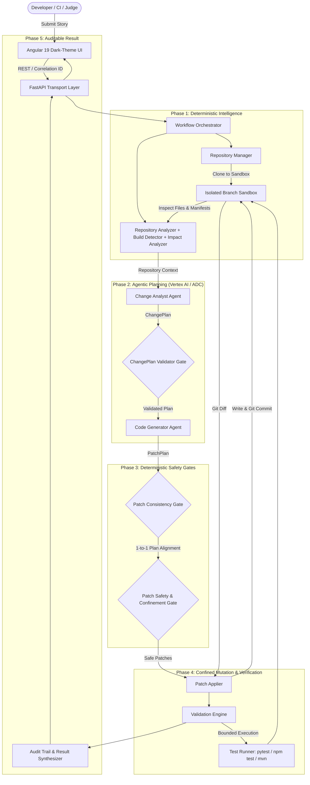
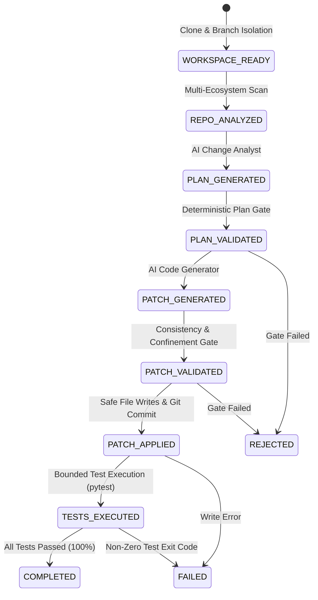

# ChangePilot — Technical Architecture & Engineering Design

ChangePilot is an autonomous software-change platform built to replace unconstrained AI coding chatbots with a deterministic, typed, and sandboxed engineering pipeline.

---

## 1. High-Level Architecture (HLD)



---

## 2. Low-Level Architecture (LLD) & Service Modules

### Module Structure
```
backend/src/
├── agents/
│   ├── adk_runner.py                  # Google ADK / GenAI SDK execution with structured schemas
│   ├── change_analyst.py              # Change Analyst agent synthesizing ChangePlan
│   ├── code_generator.py              # Code Generator agent synthesizing FilePatches
│   └── vertex_client.py               # Vertex AI / ADC client wrapper
├── api/
│   ├── routes.py                      # REST endpoints (/health, /api/repository/analyze, /api/changes/execute)
│   └── server.py                      # FastAPI application server with CORS & Static SPA serving
├── executor/
│   ├── applier.py                     # Safe filesystem mutation boundary (CREATE, MODIFY, DELETE)
│   └── validation_engine.py           # Bounded test & build runner with timeouts & output capture
├── models/
│   ├── change_plan.py                 # ChangePlan, ImpactedFile, PlannedChange schemas
│   ├── change_request.py              # ChangeRequest schema
│   ├── patch_plan.py                  # PatchPlan, FilePatch schemas
│   └── workflow_result.py             # WorkflowResult, StageExecutionRecord, ValidationResult
├── repository/
│   ├── analyzer.py                    # Multi-ecosystem topology scanner
│   ├── build_detector.py              # Language, build tool, and test runner detector
│   ├── context_builder.py             # RepositoryContext synthesizer
│   ├── impact_analyzer.py             # Probable impact and confidence score calculator
│   └── manager.py                     # Isolated branch workspace lifecycle manager
├── services/
│   ├── change_analyst_service.py      # Planning service with pre-validation
│   ├── change_executor_service.py     # Mutation and test runner service
│   └── code_generation_service.py     # Patch synthesis and consistency service
├── validators/
│   ├── change_plan_validator.py       # Validates ChangePlan against repository evidence
│   ├── patch_plan_consistency_validator.py # Enforces 1-to-1 Plan-to-Patch consistency
│   ├── patch_validator.py             # Structural syntax & size validation
│   └── security_validator.py          # Path confinement & command whitelist validator
├── workflow/
│   └── orchestrator.py                # 9-stage state machine orchestrator
└── config.py                          # Pydantic BaseSettings with ADC, timeouts, and limits
```

---

## 3. The 9-Stage State Machine Lifecycle



---

## 4. Multi-Ecosystem Detection Matrix

| Language / Framework | Build Tool | Test Framework | Detection Marker |
| :--- | :--- | :--- | :--- |
| **Python** | pip / poetry / flit | pytest / unittest | `pyproject.toml`, `requirements.txt`, `Pipfile` |
| **Angular** | npm / yarn / pnpm | karma / jasmine | `angular.json`, `@angular/core` |
| **React / Next.js** | npm / yarn / pnpm | jest / vitest | `package.json` (`react`, `next`) |
| **Java** | Maven / Gradle | JUnit / TestNG | `pom.xml`, `build.gradle`, `build.gradle.kts` |
| **Go** | go standard toolchain | go test | `go.mod`, `main.go` |
| **Rust** | cargo | cargo test | `Cargo.toml`, `src/main.rs` |
| **C# / .NET** | dotnet | xUnit / NUnit | `*.csproj`, `Program.cs` |
| **C / C++** | CMake / Make | ctest / make test | `CMakeLists.txt`, `Makefile` |

---

## 5. Security & Threat Model

1. **Path Confinement Gate:**
   Every patch target is resolved: `resolved_target.relative_to(resolved_root)`. Path traversals (`../`, `..\\`, absolute paths, drive roots) trigger immediate pipeline rejection.
2. **Command Whitelisting & Injection Prevention:**
   Commands are tokenized. Shell chaining metacharacters (`;`, `&&`, `||`, `|`, `` ` ``, `$`, `>`, `<`) are rejected before subprocess invocation.
3. **Secret Hygiene:**
   Subprocess execution explicitly scrubs sensitive environment variables (`GEMINI_API_KEY`, `GOOGLE_API_KEY`, `AWS_SECRET_ACCESS_KEY`, `GITHUB_TOKEN`).
4. **Isolated Branch Workspaces:**
   Changes execute on disposable Git branches (`changepilot/<story-id>-<uuid>`) within `temp_workspaces/`. Sandboxes are cleanly destroyed in `finally` blocks upon completion.
5. **Non-Root Docker Execution:**
   Production container runs under unprivileged UID `10001` (`appuser`).
