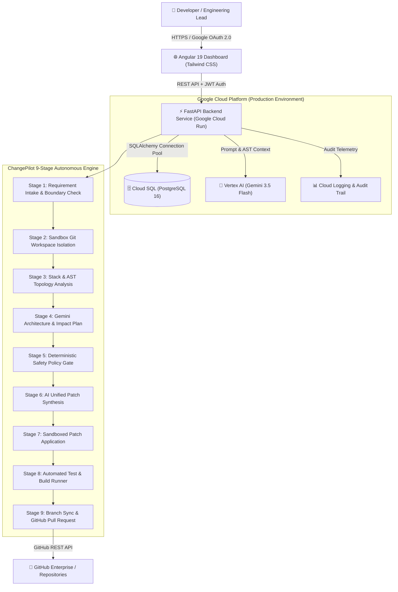
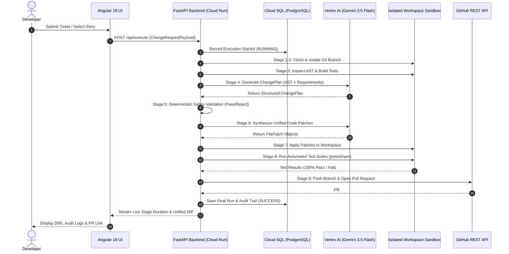

# ChangePilot — System Architecture & Design Document

[](https://changepilot-189200132893.us-central1.run.app)
[](https://cloud.google.com/vertex-ai)
[](https://cloud.google.com/sql)
[](https://angular.dev)

---

## 1. High-Level System Architecture (HLD)

ChangePilot is built with a **Safety-First Autonomous Architecture** deployed on Google Cloud Platform. It decouples user interactions, LLM reasoning, deterministic security verification, and isolated execution.



---

## 2. The 9-Stage Deterministic Safety Gate Pipeline

The core architectural innovation of ChangePilot is the **Deterministic Safety Gate Pipeline**. Unlike standard conversational AI tools that blindly execute code, ChangePilot forces every proposed change through 9 sequential gates:

| Stage # | Stage Name | Technical Action | Safety Enforcement |
| :---: | :--- | :--- | :--- |
| **1** | **Requirement Intake** | Parses user story, Jira issue, or GitHub issue parameters. | Validates branch allowlists and sanitizes input boundaries. |
| **2** | **Sandbox Setup** | Clones target repository into a temporary isolated workspace. | Creates an ephemeral Git branch (`changepilot/<story-id>-<uuid>`). Main branch is never mutated directly. |
| **3** | **Stack & Topology** | Analyzes repository AST, manifests, package managers, and test runners. | Auto-detects `pytest`, `npm test`, `mvn`, `cargo`, `go test`, or static web structures. |
| **4** | **Architecture Plan** | **Vertex AI (Gemini 3.5 Flash)** reasons on the AST to formulate a typed `ChangePlan`. | Maps impacted files, required modifications, and structural risks before writing code. |
| **5** | **Safety Policy Gate** | Deterministic security validator checks the proposed plan against zero-trust policies. | **Hard-blocks** path traversals (`..`), secret files (`.env`, `id_rsa`, `.pem`), and command injection operators. |
| **6** | **AI Code Synthesis** | Gemini synthesizes atomic unified diffs strictly conforming to the approved plan. | Patches are verified for syntactic integrity and structural consistency. |
| **7** | **Patch Application** | Filesystem mutation boundary applies additions, edits, and deletions atomically. | Enforces strict path confinement (`resolved_path.relative_to(workspace_root)`). |
| **8** | **Test Verification** | Executes real test suites inside the isolated workspace with strict timeouts. | Captures complete stdout/stderr. Fails safely if tests break or regressions occur. |
| **9** | **Branch & PR Sync** | Pushes feature branch to GitHub and opens a formatted Pull Request. | Includes comprehensive description, test evidence, and full audit logs. |

---

## 3. Data Flow & Sequence Diagram



---

## 4. Threat Model & Security Boundaries

ChangePilot is built according to **Zero-Trust Engineering Principles**:

1. **Path Confinement**: All file modifications resolve absolute paths and mathematically verify `resolved.relative_to(workspace_root)`. Path traversal attacks (`../../etc/passwd`, `C:\Windows`) fail closed immediately.
2. **Command Injection Prevention**: Shell chaining characters (`;`, `&&`, `||`, ``` ` ```, `$`, `>`, `<`) are blocked by the security validator before subprocess invocation.
3. **Secret Protection**: Protected file patterns (`.env`, `*.pem`, `id_rsa`, `*.key`, `credentials.json`) are forbidden from being modified, read, or included in patches.
4. **Isolated Ephemeral Sandboxing**: Workspaces are created in isolated temporary directories with guaranteed cleanup in `finally` blocks upon completion or failure.
5. **Role-Based Access Control (RBAC)**: All API endpoints are protected with Google OAuth 2.0 and JWT token authentication.

---

## 5. Google Cloud Infrastructure Topology

* **Google Cloud Run**: Serverless container execution hosting the containerized FastAPI backend and Angular frontend.
* **Google Cloud SQL (PostgreSQL 16)**: High-availability relational database storing multi-tenant user accounts, assigned tickets, pipeline execution runs, and audit logs.
* **Google Vertex AI (Gemini 3.5 Flash)**: Foundation model provider handling whole-codebase AST reasoning, change plan formulation, and unified code diff generation.
* **Google Cloud Logging**: Centralized, structured audit log aggregation for enterprise traceability.
