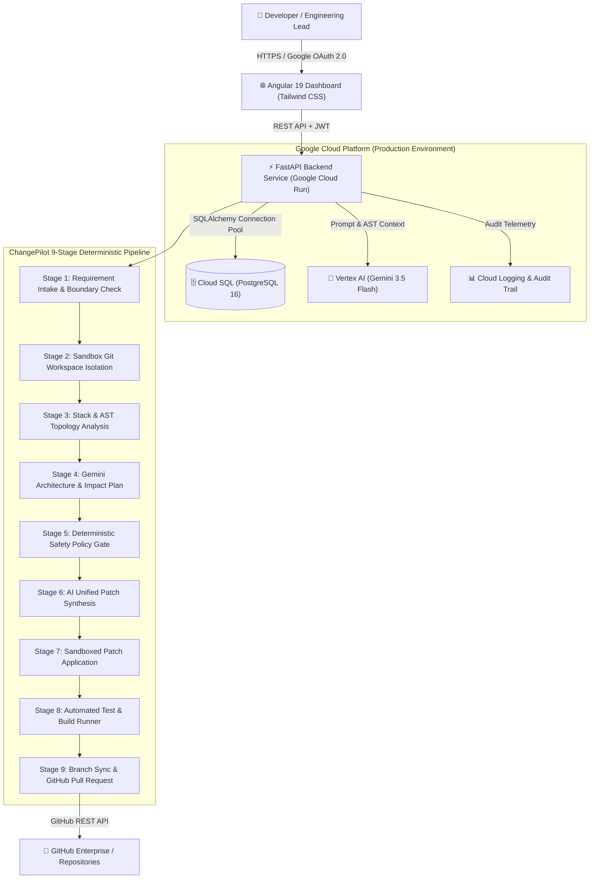

# ChangePilot — Autonomous Software Change & Deterministic Safety Gate Platform

[](https://changepilot-189200132893.us-central1.run.app)
[](https://cloud.google.com/vertex-ai)
[](https://cloud.google.com/sql)
[](https://angular.dev)
[-10B981?style=for-the-badge&logo=pytest&logoColor=white)](https://pytest.org)

> **Built for the Google All Things Agentic Hackathon**
>
> **Live Production App:** [https://changepilot-189200132893.us-central1.run.app](https://changepilot-189200132893.us-central1.run.app)  
> **Target Tracks:** *The Fortified Enterprise Fleet* • *The Taskmaster* • *Best Architectural Design*

---

## 💡 What is ChangePilot?

Most AI coding tools are static conversational chat loops requiring continuous human copy-pasting. **ChangePilot** is an enterprise-grade autonomous software change agent that operates independently:
1. Ingests natural language requirements or assigned issues from **Jira Cloud**, **Azure DevOps**, and **GitHub**.
2. Analyzes codebase topology, ASTs, and test suites across an **isolated sandbox workspace**.
3. Formulates a typed architecture plan and synthesizes atomic unified code patches with **Google Vertex AI (Gemini 3.5 Flash)**.
4. Executes real test runners (`pytest`, `npm test`, `mvn`, `cargo`, `go test`) in sandbox isolation.
5. Pushes an isolated feature branch and opens a verified **GitHub Pull Request** with test evidence and audit logs.
6. Enforces **9 deterministic safety gates** to prevent hallucination, secret leaks, and path traversal attacks.

---

## 🏛️ System Architecture



---

## 🛡️ 9-Stage Deterministic Safety Gate Pipeline

Unlike brittle prompt-only agents, ChangePilot enforces **non-negotiable deterministic security gates**:

| Stage # | Stage Name | Responsibility & Safety Guard |
| :---: | :--- | :--- |
| **1** | **Requirement Intake** | Parameter verification, branch allowlist checking, and input sanitization. |
| **2** | **Sandbox Setup** | Creates an isolated ephemeral Git workspace (`changepilot/<story-id>-<uuid>`). Main branch is never directly mutated. |
| **3** | **Stack & Topology** | Deterministic language detection, framework analysis, and test runner discovery. |
| **4** | **Architecture Plan** | Vertex AI Gemini reasons on AST and outputs a typed `ChangePlan` (impacted files, risk rating). |
| **5** | **Safety Policy Gate** | **Zero-trust policy gate**: Rejects path traversals (`..`), sensitive files (`.env`, `id_rsa`, `.pem`), and dangerous shell operators (`&&`, `;`, `|`). |
| **6** | **AI Code Synthesis** | Synthesizes exact unified diffs conforming 1-to-1 with the approved `ChangePlan`. |
| **7** | **Patch Application** | Atomically applies file changes inside the sandbox workspace. |
| **8** | **Test Verification** | Executes real test runners with strict timeouts. Fails safely if tests break. |
| **9** | **Branch & PR Sync** | Pushes feature branch to GitHub and opens a formatted Pull Request with audit metadata. |

---

## ⚡ 1-Minute Live Demo (Try It Yourself)

1. Open the **Production App**: [https://changepilot-189200132893.us-central1.run.app](https://changepilot-189200132893.us-central1.run.app)
2. Click **"Continue with Google"** (or use any email).
3. On the **Dashboard**, click any assigned ticket from Jira/GitHub (e.g. `CP-1042: Add Percentage Discount Rule to Calculator Engine`).
4. Click **"Run ChangePilot"**.
5. Watch all **9 stages illuminate in real-time**, view the side-by-side **Unified Diff**, and inspect the created **GitHub Pull Request**!

---

## 💻 Local Quickstart & Reproduction

### Prerequisites
- Python 3.11+
- Node.js 20+ & npm
- Git

### 1. Clone & Install Backend
```bash
git clone https://github.com/kameswarpanda/project-changepilot.git
cd project-changepilot

# Setup virtual environment
python -m venv .venv
source .venv/bin/activate  # Or .venv\Scripts\activate on Windows

# Install dependencies
pip install -r backend/requirements.txt
```

### 2. Run Automated Verification Tests (58/58 Passing)
```bash
python -m pytest backend/tests/ -v
```

### 3. Run FastAPI Backend Server
```bash
python -m uvicorn backend.src.api.server:app --host 0.0.0.0 --port 8000 --reload
```
API Documentation available at `http://localhost:8000/docs`.

### 4. Run Angular 19 Frontend
```bash
cd frontend
npm install
npm start
```
Open `http://localhost:4200` in your browser.

---

## ☁️ Google Cloud Services Utilized

- **Google Cloud Run**: Containerized backend and frontend deployments with automated autoscaling.
- **Google Cloud SQL (PostgreSQL 16)**: Multi-tenant database for user profiles, pipeline runs, and audit logs.
- **Vertex AI (Gemini 3.5 Flash)**: Foundation model for AST reasoning, impact planning, and code patch synthesis.
- **Google Cloud Logging**: Audit trail monitoring for enterprise compliance.
- **Google OAuth 2.0**: Enterprise SSO authentication.

---

## 👥 Hackathon Team & Acknowledgments

- **Developer / Creator**: Kameswar Panda
- **Hackathon**: Google All Things Agentic Hackathon on Devpost

