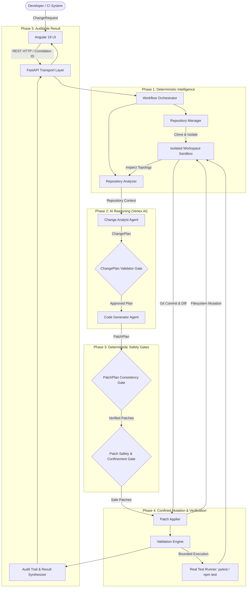

# ChangePilot — Autonomous Software-Change Platform

> **Hackathon Narrative:** ChangePilot is **NOT** an unconstrained LLM coding chatbot. It is a controlled, production-oriented software-change pipeline where repository intelligence, typed AI outputs, deterministic validation gates, workspace isolation, and bounded real test execution work together.

---

## 1. High-Level Architecture (HLD)

ChangePilot enforces a strict **trust boundary**: User requests, repository code, and LLM proposals are considered untrusted. Deterministic validation gates decide whether anything is permitted to mutate the isolated workspace.



---

## 2. Low-Level Architecture (LLD)

### Layer Responsibilities
| Component | Module | Responsibility |
| :--- | :--- | :--- |
| **FastAPI Transport** | `backend.src.api` | Thin transport layer with correlation IDs, health probes, Pydantic schemas, safe error masking. |
| **Workflow Orchestrator** | `backend.src.workflow` | Owns complete execution lifecycle across 9 discrete stages with guaranteed workspace cleanup in `finally` blocks. |
| **Repository Manager** | `backend.src.repository.manager` | Creates isolated workspace per run, enforces Git URL allowlists, clone timeouts, repository byte/file limits. |
| **Repository Analyzer** | `backend.src.repository.analyzer` | Deterministic language detection, framework recognition (pytest, FastAPI, Angular, etc.), manifest parsing. |
| **Change Analyst Agent** | `backend.src.agents.change_analyst` | Generates typed `ChangePlan` strictly grounded in repository evidence without mutating filesystem. |
| **ChangePlan Validator** | `backend.src.validators.change_plan_validator` | Rejects ungrounded file modifications, non-existent targets, or path traversals. |
| **Code Generator Agent** | `backend.src.agents.code_generator` | Proposes exact `FilePatch` objects conforming to the approved `ChangePlan`. |
| **Patch Consistency Validator**| `backend.src.validators.patch_plan_consistency_validator` | Enforces strict 1-to-1 consistency between generated patches and approved `ChangePlan`. |
| **Patch Safety Validator** | `backend.src.validators.patch_validator` | Verifies structural syntax, size limits, and path confinement (`Path.resolve().relative_to(root)`). |
| **Patch Applier** | `backend.src.executor.applier` | Filesystem mutation boundary (CREATE only if nonexistent, MODIFY only if exists, DELETE only if planned). |
| **Validation Engine** | `backend.src.executor.validation_engine` | Executes allowlisted test commands (`pytest`, `npm test`) with hard timeout and output capture. |
| **Angular 19 UI** | `frontend/` | Dashboard with pipeline stage progress stepper, unified diff viewer, interactive test logs, and audit trail. |

---

## 3. Safety & Security Architecture

1. **Path Confinement**: All file mutations resolve absolute paths and verify `resolved.relative_to(workspace_root)`. Path traversal attacks (`../`, absolute drive roots) fail closed.
2. **Command Abuse Prevention**: Shell chaining operators (`;`, `&&`, `||`, `` ` ``, `$`, `>`, `<`) are rejected. Only allowlisted test runners (`pytest`, `python`, `npm`, `mvn`, `gradle`, `cargo`, `go`, `dotnet`) execute.
3. **Secret Hygiene**: Environment variables with sensitive tokens (`GEMINI_API_KEY`, `AWS_SECRET_ACCESS_KEY`, `GITHUB_TOKEN`) are stripped before executing test subprocesses. `.env` is never copied into container images.
4. **Isolated Sandboxing**: Every run executes in a dedicated temporary workspace directory on a dynamically created Git branch (`changepilot/<story-id>-<uuid>`).
5. **Non-Root Runtime**: Production Docker container runs under unprivileged UID `10001` (`appuser`).

---

## 4. End-to-End Demo Scenario (Calculator Flat Discount)

The demo scenario exercises the entire autonomous loop on `demo_repo/`:
1. **Developer Request**: Story `CP-DEMO-1`: Add optional flat monetary discount to `calculate_total`, preserving existing callers, rejecting negative discounts and discounts larger than calculated total with `ValueError`, and updating unit tests.
2. **Analysis**: Detects Python 3, `pytest` framework, and `calculator.py` / `test_calculator.py`.
3. **ChangePlan**: Plans `MODIFY` on `calculator.py` and `test_calculator.py` with confidence scores and risk analysis.
4. **Plan Gate**: Verified against repository evidence.
5. **PatchPlan**: Proposes full implementation with backward-compatible `apply_discount` and comprehensive tests.
6. **Patch Gate**: Verified for consistency and path confinement.
7. **Mutation**: Safely written to isolated feature branch.
8. **Test Execution**: `pytest` executes automatically inside isolated sandbox. All tests pass with 100% success.
9. **UI & Audit**: Unified diff, test output, and stage timings presented in the Angular dashboard.

---

## 5. Quick Start (Local-First Execution)

### Prerequisites
- Python 3.11+
- Node.js 20+ & npm

### 1. Setup Backend
```bash
# Create and activate virtual environment
python -m venv .venv
.\.venv\Scripts\activate  # Windows
# source .venv/bin/activate  # Linux/macOS

# Install dependencies
pip install -r backend/requirements.txt
```

### 2. Run Backend Tests (100% Automated Coverage)
```bash
pytest backend/tests -v
```

### 3. Run FastAPI Backend Server
```bash
python -m uvicorn backend.src.api.server:app --host 0.0.0.0 --port 8000 --reload
```
API Documentation available at: `http://localhost:8000/docs`

### 4. Run Angular Frontend
```bash
cd frontend
npm install
npm start
```
Access UI at: `http://localhost:4200`

---

## 6. Docker Container Production Run

```bash
# Build multi-stage container
docker build -t changepilot:latest .

# Run container locally
docker run -d -p 8000:8000 --name changepilot-app changepilot:latest

# Check health
curl http://localhost:8000/health
```

---

## 7. Failure Scenarios Verified in Test Suite

| Scenario | Tested Behavior | Status |
| :--- | :--- | :--- |
| **Invalid Repository Location** | Rejected at `WORKSPACE_READY` before clone | ✅ Passed |
| **Path Traversal Attack** (`../escape.py`) | Traversal detected, operation rejected | ✅ Passed |
| **Ungrounded ChangePlan** | Rejected at `PLAN_VALIDATED` gate | ✅ Passed |
| **Inconsistent Code Patch** | Patch touching unapproved file rejected at `PATCH_VALIDATED` | ✅ Passed |
| **Execution Timeout** | Hard timeout safely aborts runaway process | ✅ Passed |
| **Shell Injection in Commands** | Shell operators detected and blocked | ✅ Passed |
| **Non-Zero Test Exit Code** | Reports explicit test failure with stdout/stderr diagnostics | ✅ Passed |
